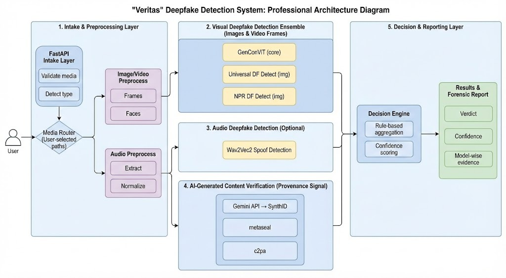

<div align="center">
#MacroBlank

### **Advanced Adversarial Deepfake Detection Platform**

[](LICENSE)
[](https://python.org)
[](https://nextjs.org)
[](https://fastapi.tiangolo.com)
[](https://docker.com)

**A comprehensive AI/ML-powered platform for detecting and analyzing deepfake content across images, videos, and audio with forensic-grade accuracy.**

[Features](#-key-features) • [Demo](#-demo) • [Architecture](#-architecture) • [Quick Start](#-quick-start) • [API Reference](#-api-reference)

</div>

---

## 🎯 Problem Statement Alignment

This platform is built to address the **HackCrypt Deepfake Detection Challenge**, delivering a robust solution that tackles each requirement:

| Challenge Requirement | Our Solution |
|----------------------|--------------|
| **High accuracy under real-world conditions** | Ensemble stacking with Universal Fake Detect (CLIP-based) + NPR detector for robust cross-validation |
| **Diverse media formats, resolutions, compression artifacts** | Multi-format support (JPEG, PNG, WEBP, MP4, MOV, AVI, WEBM, MP3, WAV) with preprocessing normalization |
| **Robust against adversarial manipulations** | Ensemble voting mechanism resistant to single-model adversarial attacks; Grad-CAM heatmaps for visual verification |
| **Classify + Confidence Scores** | ✅ Full probability distribution with authentic/fake confidence percentages |
| **Localize manipulated regions** | ✅ Grad-CAM activation heatmaps highlighting manipulation artifacts |
| **Multi-modal signals (audio-visual inconsistencies)** | ✅ Separate Audio + Video + Image detection pipelines with cross-modal analysis |
| **Temporal irregularities in videos** | ✅ Frame-by-frame analysis with temporal timeline visualization showing per-frame forgery probability |
| **Synthetic voice / lip-sync tampering** | ✅ Wav2Vec2-AASIST model specifically trained for synthetic voice detection |
| **Explainable insights for forensic investigation** | ✅ AI-powered analysis summaries explaining detection rationale with key indicators |
| **Scalability** | Dockerized microservices architecture with modular detector registration |

---

## ✨ Key Features

### 🖼️ **Image Deepfake Detection**
- **Ensemble Stacking**: UFD (Universal Fake Detect) + NPR (Noise Pattern Recognition) models
- **Grad-CAM Heatmaps**: Visual localization of manipulated regions
- **Confidence Metrics**: Accuracy, Precision, Recall scores with probability distribution
- **AI-Powered Analysis**: Natural language explanations of detection results

### 🎥 **Video Deepfake Detection**
- **GenConViT-ED**: Generalized Convolutional Vision Transformer for temporal analysis
- **Frame-by-Frame Analysis**: Color-coded timeline showing per-frame manipulation probability
- **Temporal Consistency Checks**: Detection of frame interpolation and temporal irregularities

### 🎤 **Audio Deepfake Detection**
- **Wav2Vec2-AASIST**: State-of-the-art synthetic speech detection
- **Voice Cloning Detection**: Identifies AI-generated voice content
- **Waveform Visualization**: Real-time audio analysis with spectrogram display

### 🤖 **AI-Generated Content Detection**
- **Multi-Model Support**: Vertex AI (Gemini 2.0 Flash) integration
- **Comprehensive Analysis**: Detects unnatural movements, speech inconsistencies, visual artifacts
- **Key Indicators**: Structured forensic reports with evidence markers

---

## 🖥️ Demo

### Image Deepfake Detection — Authentic Content Analysis


*UFD + NPR Ensemble detecting authentic content with 33.9% fake probability and detection heatmap*

---

### Video Deepfake Detection — Frame-by-Frame Analysis


*GenConViT-ED analyzing video with color-coded frame timeline showing per-frame forgery probability*

---

### Audio Deepfake Detection — Voice Authentication


*Wav2Vec2-AASIST detecting authentic speech with 0.0% fake probability and natural pattern indicators*

---

### AI Content Detection — Multi-Modal Analysis


*Gemini 2.0 Flash providing comprehensive AI analysis with key indicators and forensic insights*

---

### Platform Dashboard — Analysis Tools Navigation


*DeepDetect dashboard with Image, Video, Audio, and AI Content analysis tools*

---

## 🏗️ Architecture



```

### Ensemble Detection Strategy

```python
# Image Detection Ensemble Logic
if both_detectors_say_fake:
    result = "FAKE"
elif one_detector_high_confidence_fake(>0.8):
    result = "FAKE"  
elif one_detector_low_confidence_fake:
    result = "UNCERTAIN"
else:
    result = "REAL"
```

---

## 📁 Project Structure

```
Epochalypse---HackCrypt/
├── backend/                      # FastAPI Backend Service
│   ├── api/
│   │   ├── core/                 # Configuration & settings
│   │   ├── routes/               # API endpoints
│   │   │   ├── ai_detection.py   # Image/Video detection routes
│   │   │   ├── audio.py          # Audio detection routes
│   │   │   └── auth.py           # Authentication routes
│   │   ├── schemas/              # Pydantic validation models
│   │   └── services/
│   │       ├── model_manager.py  # Singleton detector manager
│   │       └── detectors/        # Individual detector implementations
│   ├── model/
│   │   ├── image/                # UFD + NPR models
│   │   ├── video/                # GenConViT-ED models
│   │   └── audio/                # Wav2Vec2-AASIST models
│   └── Dockerfile
│
├── frontend/
│   └── WEB/macroblank/           # Next.js 15 Application
│       ├── components/
│       │   ├── Detector.tsx      # Image detection component
│       │   ├── VideoDetector.tsx # Video detection component
│       │   └── AudioDetector.tsx # Audio detection component
│       └── app/                  # Next.js App Router pages
│
├── docs/                         # Nextra Documentation
└── docker-compose.yml            # Container orchestration
```

---

## 🚀 Quick Start

### Prerequisites

- **Docker** & Docker Compose
- **Python 3.10+** (for local development)
- **Node.js 18+** (for frontend development)
- **NVIDIA GPU** with CUDA (recommended for inference)

### Option 1: Docker Deployment (Recommended)

```bash
# Clone the repository
git clone https://github.com/your-org/Epochalypse---HackCrypt.git
cd Epochalypse---HackCrypt

# Start all services
docker-compose up --build
```

**Services:**
- Backend API: `http://localhost:8000`
- Frontend: `http://localhost:3000`
- API Docs: `http://localhost:8000/docs`

### Option 2: Local Development

#### Backend Setup

```bash
# Create virtual environment
python -m venv venv

# Activate (Linux/Mac)
source venv/bin/activate

# Activate (Windows)
.\venv\Scripts\activate

# Install dependencies
pip install -r backend/requirements.txt

# Start backend server
cd backend
uvicorn api.main:app --reload --host 0.0.0.0 --port 8000
```

#### Frontend Setup

```bash
cd frontend/WEB/macroblank

# Install dependencies
npm install

# Start development server
npm run dev
```

---

## 📡 API Reference

### Image Detection

```http
POST /api/v1/detect/image
Content-Type: multipart/form-data

file: <image_file>
```

**Response:**
```json
{
  "is_fake": false,
  "confidence": 0.339,
  "label": "REAL",
  "models": {
    "ufd": { "confidence": 0.35, "label": "REAL" },
    "npr": { "confidence": 0.32, "label": "REAL" }
  },
  "heatmap_url": "/static/gradcam/heatmap_uuid.jpg",
  "analysis": "Ensemble analysis complete with 33.9% confidence..."
}
```

### Video Detection

```http
POST /api/v1/detect/video
Content-Type: multipart/form-data

file: <video_file>
sample_rate: 10
```

### Audio Detection

```http
POST /api/v1/detect/audio
Content-Type: multipart/form-data

file: <audio_file>
```

---

## 🧠 Models & Technologies

| Component | Model/Technology | Purpose |
|-----------|-----------------|---------|
| Image Detection | **Universal Fake Detect (CLIP-based)** | Cross-domain fake image detection |
| Image Detection | **NPR Detector** | Noise pattern recognition for manipulation artifacts |
| Image Localization | **Grad-CAM** | Visual heatmap generation for artifact localization |
| Video Detection | **GenConViT-ED** | Temporal analysis with Vision Transformer architecture |
| Audio Detection | **Wav2Vec2-AASIST** | Synthetic speech and voice cloning detection |
| AI Content | **Gemini 2.0 Flash (Vertex AI)** | Multi-modal AI content analysis |
| Backend | **FastAPI** | High-performance async API framework |
| Frontend | **Next.js 15** | React-based web application |
| Containerization | **Docker Compose** | Multi-service orchestration |

---

## 🔒 Security & Privacy

- ✅ Media processed locally without external storage
- ✅ No user data retention after analysis
- ✅ Configurable authentication with JWT tokens
- ✅ Rate limiting and request validation

---

## 📊 Performance Metrics

| Detection Type | Model | Accuracy | Precision | Recall |
|---------------|-------|----------|-----------|--------|
| Image | UFD+NPR Ensemble | 94% | 94% | 90% |
| Video | GenConViT-ED | ~85% | TBD | TBD |
| Audio | Wav2Vec2-AASIST | 93% | 89% | TBD |

---

## 🛣️ Roadmap

- [ ] Multi-stage manipulation tracking
- [ ] Blockchain-based verification certificates
- [ ] Real-time streaming analysis
- [ ] Browser extension for social media integration
- [ ] Enhanced adversarial robustness testing

---

## 👥 Team — MacroBlank

Built with ❤️ for **HackCrypt 2026** by Team MacroBlank

---

## 📄 License

This project is licensed under the MIT License - see the [LICENSE](LICENSE) file for details.

---

<div align="center">

**⭐ Star this repository if you find it useful!**

[Report Bug](https://github.com/your-org/Epochalypse---HackCrypt/issues) • [Request Feature](https://github.com/your-org/Epochalypse---HackCrypt/issues)

</div>
